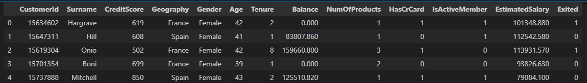
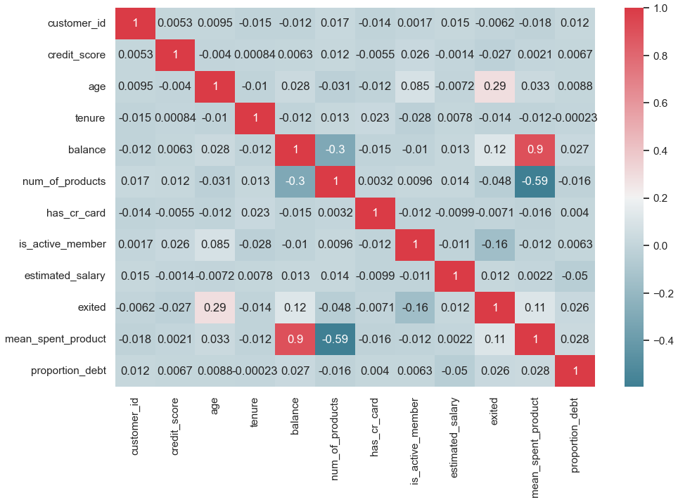
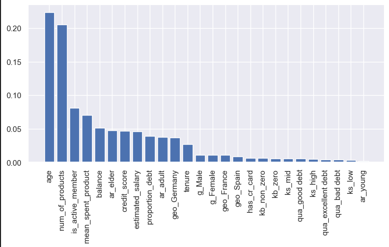

# The Client Churn Prediction - TOP BOTTOM COMPANY

The TopBottom company need our services in order to verify the churn rate and predict possible churns in the future. They verified recency has decreased few months ago.

The dataset:
- **RowNumber**: number of column
- **CustomerID**: client ID
- **Surname**: client last name
- **CreditScore**: Consumption market score
- **Geography**: Estate of client's residence
- **Gender**: client gender (male/female)
- **Age**: client age
- **Tenure**: number of years the client stayed active
- **Balance**: Amount of money in the customers' account
- **NumOfProducts**: Number of products bought by the client
- **HasCrCard**: Identify if the client has or no a credit card
- **IsActiveMember**: Identify if the client still has an active registry in TopBottom (within the last 12 months)
- **EstimateSalary**: client estimated anual salary
- **Exited**: Identify if the client is or no in **CHURN**

> link: https://www.kaggle.com/datasets/mervetorkan/churndataset

## The Dataset

- Number of Rows: **10000** and Columns: **13**
- No NaN values
- Churn (**2037** => **20%**) and Non-Churn (**7963** => **80%**)
- We have most of the columns with a left-sided distribution (not a perfect normal dist), with low peak (kurtosis < 0)

## Feature Engineering

Features created:
- `qualification`: "bad debt", "good debt" and "excellent debt"
- `age_range`: "young", "adult" and "elder"
- `mean_spent_product`= "balance" / "num_of_products"
- `proportion_debt`= "balance" / "estimated_salary"
- `kind_balance`: "zero" and "non_zero"
- `kind_salary`: "low", "mid" and "high"

## EDA
#### Univariate Analysis

- We have many registries with "non-zero" in BALANCE column
- Good debt is predominant and have much more churn than others
- Churn seems to be more involved with AGE, since the distribution is nearly right-sided than Non-Churn

#### Bivariate Analysis

Hipothesis evaluated
##### Hipothesis Conclusion

| Hipothesis Number | Description | Conclusion |
|:----------------:|:------------:|:-----------:|
|  H1 | Good and Excellent Debt are more concentrated in the ADULT range than others | TRUE |
| H2 | Bad Debt are concentrated under 30-year |  FALSE |
|  H3 | High Tenure is concentrated in Elder range |  FALSE |
|  H4 | Under 35-year has more CreditCard than others |  FALSE |
| H5 | Churn is concentrated under 40-year |  FALSE |
|  H6 | Churn is concentrated less than 3 Tenure |  FALSE |
|  H7 | Churn is concentrated in Bad Debt than others |  FALSE |
|  H8 | The Balance increase long the Tenure |  FALSE |
| H9 | Churn is concentrated in Active customers |  FALSE |
| H10 | Mean Spent Amount above 25k has more Churn |  TRUE |
| H11 | Who buys 1 product only has more Churn than others |  TRUE |
| H12 | Germany has more Churn than others | TRUE |

#### Multivariate Analysis

The most relevant correlations where on variables which have dependencies each other

## Data Preparation
- MinMaxScaler on: 'credit_score', 'age', 'tenure', 'balance','num_of_products','estimated_salary','mean_spent_product', 'proportion_debt'
- Categorical encoding on: 'geography','gender','qualification','age_range','kind_salary','kind_balance'

## Feature Selection

- Boruta selection: 'age', 'num_of_products', 'mean_spent_product'
- Tree-based selection (90% of relevance): 'age','num_of_products','is_active_member','mean_spent_product','balance','ar_elder','credit_score','estimated_salary','proportion_debt','ar_adult','geo_Germany'

## Modeling ML

- SMOTETomek for balance the dataset
- Tested some models and chosen XGBClassifier
- Made a RandomSearchCV for Hyerparameter Tuning
- Compared performance via ROC curve and Precision x Recall
- Calibrated and evaluated

> ROC CURVE

> PRECISION x RECALL

> GAIN CURVE XGB

> CALIBRATED XGB

> Final metrics XGB
| Model name | Precision | Recall |
|:-----------:|:--------:|:-----------:|
| XGBClassifier| 0.594 +/- 0.027 | 0.597 +/- 0.040 |

## Business Performance
The budget for the action plan to reduce the churn rate of clients is **$10.000,00**. 

The business and marketing teams worked together on a study and arrived at three options. 

It is now up to the Data Science team choose which option maximaze ROI - Return on Investment.

The strategy is to make a simulation in the dataset with all the three options and choose the option which gives the best results The revenue from clients is calculated as follows:
- Clients **above** average: returns **3%** of their **Estimated Salary**;
- Clients **below** average: returns **5%** of their **Estimated Salary**;

The mean Estimated Salary is **$100.090,00**. For example, if the client's yearly Estimated salary is **$100.000,00** the bank has a **$100.000,00 x 5%** = **$5.000,00** yearly return per client.

> With a cupom of **$ 50**...
> If the top clients were recovered: **$736,073.54**
> Non-churn clients those received the discount: **$100.00**
> Pessimistic scenario **$515,251.48**
> Realistic scenario: **$588,858.83**
> Optimist scenario: **$662,466.19**
> Average scenario: **$588,858.83**
> ROI: **5,888.59 %**
